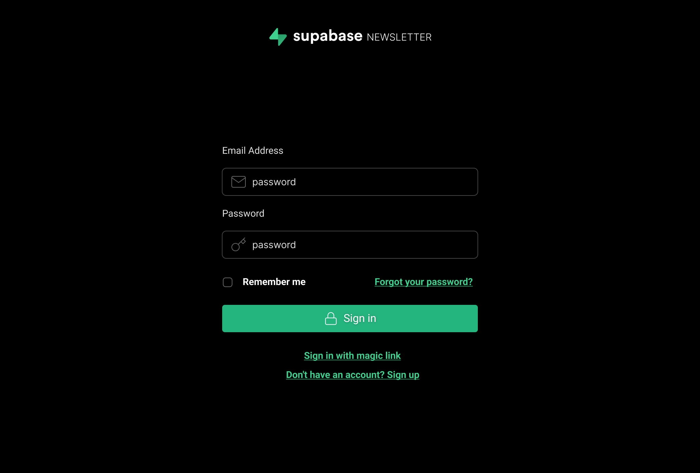
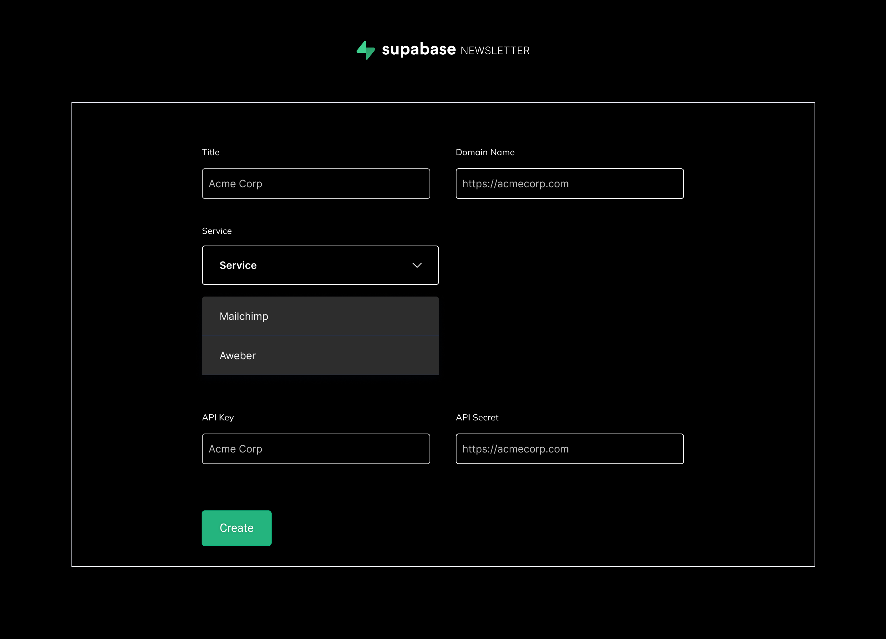
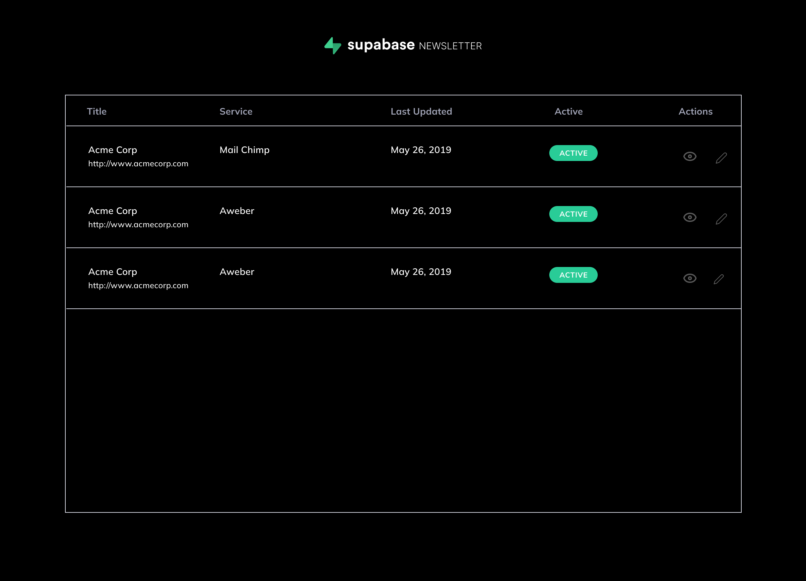
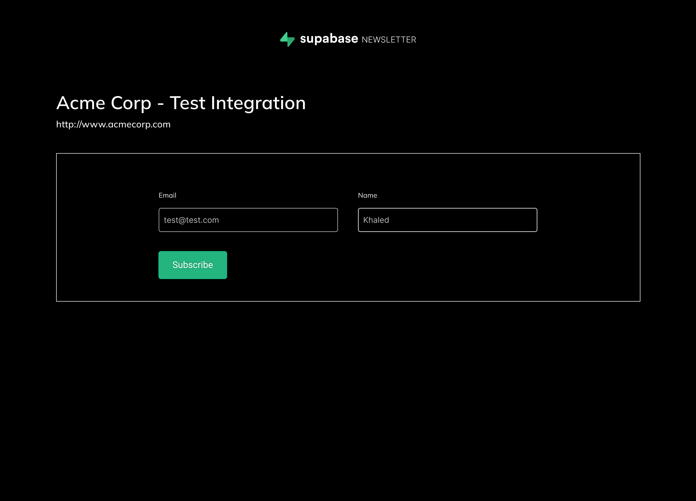

# Motivation
Grant permissions to external services in minutes

**Example use cases:**

-You want to grant permission to your Mailchimp account to notify customers of key events in your application or perform certain actions.

-You want to allow your users to integrate with their MailChimp/Twilio account, so that they can notify their customers on key events or perform certain actions.

-You want to allow your users to intenerate with their Github account to automatically perform spell checks on their commits. etc.

**Features:**

-Supports multi-tenant Application (Can integrates with your services and your user' services)

-Stores access_token needed to make API calls to different services

-Automatically refreshes access_token when it expires

-A monorepo with a growing list of services that it integrates with out of the box.

**Contributers:**

KhaledGabr

m3schroder

**Built using Supabase**

Uses supabase functions & supabase Auth

# Getting Started
The package.json contains a script "db-generate" that can be used to generate the **"Database"** type that reflects the current 
<strong  style="color: #22c55e">Supabase</strong> database. 

In a typescript project you can use this "Database" to strongly type the <strong style="color: #22c55e">Supabase</strong> object.

---

